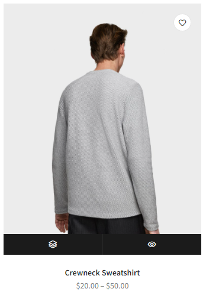

# Projet JS

## Consignes

1. Site à reproduire en HTML/SASS(SCSS)/Bootstrap/JS
2. Le site doit être responsive (PC, tablette, GSM)
3. Vous pouvez vous entraider, mais vous ne pouvez pas vous partager le code, toute copie sera considéré comme plagiat et les deux personnes rateront leur projet
4. Date de remise : Jeudi 16/06 à 17h00 sur un repo privé sous le nom de : cs23_projetjs_nom_prenom
5. Après chaque section, vous devez faire des sauvegardes 

## Fonctionnalités en JS

### Header

1. La barre de navigation doit rester fixe une fois qu'on dépasse le texte "womens" et avoir une couleur d'arrière-plan en noir avec le texte en blanc.

2. Dans la navbar vous devez créer un toggle switch, lorsqu'il est désactivé, le site est en mode clair, quand il est activé, le site est en mode sombre

3. Dans l'icone du user dans la navbar, au click, il faut qu'un modal s'affiche avec une inscription ou un log in. (Modal bootstrap)

### Recents products

4. La partie "recents products" doit être faite complètement en JS. Vous allez créer une section#products en html, et le reste vous allez le créer en JS. Pour les informations comme le lien de l'image, le texte, le prix, etc, doivent être des objets dans un tableau.
>Ex : let produits = [
>    {
>        nom : "Produit 1",
>        texte : "Texte 1",
>        ...
>    },
>    {
>        ...
>    }
>]

5. Quand on survole un produit, un hover affiche 2 éléments comme vous le voyez sur l'image screenshot-product.png. Vous allez changer les icônes par un cœur et un panier. Quand on appuie sur le cœur, le cœur de la navbar affiche un span avec un 1, si on appuie sur le cœur d'un autre produit, le span aura un 2, etc. Et la même chose avec le panier.

### Testimonials

6. Vous devez faire un carrousel en JS sur les testimonials. Donc vous allez ajouter deux flèches aux extrémités, et quand on appuie sur celle de gauche, on va en arrière et si on appuie sur celle de droite, on avance d'un.

### Bonus
7. Un compte à rebours sur un produit aléatoire